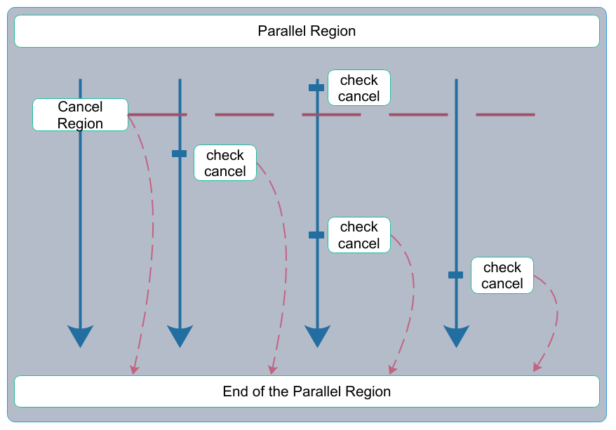

# Foundations of HPC 

# @ Data Science and Scientific Computing 2019-2020

### <font color='red'>ASSIGNMENT II, Nov 29</font>
#### <font color='red'>Due date: Dec, 16th</font>

##### _<font color='red'>pls note the change : this assignment is worth 20% of the final mark; the BIG-1, in the Xmas break, will count as 30% </font>_

**In this assignment, the request is:**

- **to work out the exercise 0**
- **to work out one exercise chosen from the pool of problems [1-3]**

Please, email me the materials in the form of attached tar  _by the midnight of the due date_ :

<font color='red'>_luca.tornatore@inaf.it_</font>

A quite logical way to present the work would be:

- create a new folder with your name
- put the report in that folder, either in pdf (preferred) or in some other standard format
- create separate sub-folders, `Exercise0`, and`Exercise1` 
- upload in each sub-folder the relative source codes, makefiles and data file, if any, and a readme file with any note that may be substantially useful for the comprehension or the evaluation

#### <font color='red'>Marks</font>

If correctly solved: 

- Exercise 0 gives you **12 **points, or **15** if you solve its optional requirement (see in the text below);
- Exercise 1 and 2 are worth **18** points each;
- Exercise 3 is worth **22** points (since it involves writing code from scratch, it is valued more).

Hence, the grand total ranges from **30** points (Ex 0 + 1), up to **37** points (Ex 0+optional and 3).

**<font color='red'> On _Wednesday, Dec 4_ I could be available in the afternoon for clarification, questions, comments, requests. Send me an email in time to set it up.</font>**


> **NOTE 1**: in the text below we refer to a generic "node", and to "_$N_c$_" cores, on which you should run the codes. Of course, the reference is to Ulysse's nodes, so using from 1 to _$N_c$_=20_ cores.
> However, if you have access to any different facility, do not hesitate to use it (in this case, please also summarize its architecture and the node's topology).

> **NOTE 2**: on Ulysses there are only `gcc 4.9.2` or `icc 14.0`. Both of them are quite old. Choose the one that support the latest version of OpenMP ( you should be able to find it out using the `omp_versions.c` code in `D11/OpenMP/` )

> **NOTE 3**: There are some Appendices at the end of this page. I present there some materials that may be useful for this assignment.


------------

---------------------------------

### EXERCISE 0 *(mandatory)*

#### Touch-First vs Touch-by-All policy

Take the source codes `01_array_sum.c` and `06_touch_by_all.c` that you find either in the `D11/OpenMP/parallel_loops` directory or in the `Assignment02/` directory, in the GIT repo.

Both of the two codes sum-up the first N integer numbers, assigning to an array of double the value corresponding to its position, `array[i] = (double)i`.
As we have seen, the fundamental difference between these two codes is the fact that in the first one the memory is initialised by the thread 0, whereas in the other code each thread initialises its memory.

**<font color='green'> $\blacktriangleright$  You have to study the behaviour of the two codes:</font>**

1. measure the time-to-solution of the two codes in a strong-scaling test (use some meaningful value for _N_, like 10^9^), using from 1 (using the serial version) to _$N_c$_ cores on a node;
2. measure the parallel overhead of both codes, from 2 to _$N_c$_ cores on a node;
3. provide any relevant metrics that explain any observed difference;

_<font color='green'>Optional but greatly appreciated ( meaning: not mandatory to obtain the full mark, but a correct implementation may furnish you 3 additional points ):</font>_

_figure out how you could allocate and correctly initialise the right amount of memory separately on each thread_


----

### EXERCISE 1

#### Re-write the MPI program that calculates the value of PI with OpenMP only

**<font color='green'>$\blacktriangleright$  The request is to translate the MPI program that has been given for Assignment I into an OpenMP one.</font>**
After that, study its behaviour on a node of Ulysse:

1. establish its weak and strong scalability;

2. estimate the parallel overhead;
3. compare the performance of your OpenMP version and of the MPI version, in terms of time-to-solution and of parallel efficiency.
   _Run the MPI version with $N_c$ processes (i.e. $N_c$ = the largest number of physical threads that you have on the node) both on the single node that you use for the OpenMP version and on multiple nodes (keeping constant the number of processes). That should allow you to understand the impact of the network and how good is the shared-memory implementation of the MPI library._

> note: Appendix I here below may be useful


----

### EXERCISE 2

#### Binary search with OpenMP

**<font color='green'>$\blacktriangleright$  The task in this exercise is to is  OpenMP-ize the binary search program that you have seen in the lecture about the prefetching.</font>**

Then, you have to report about the performance comparison of the serial and the parallel version.
Performance is about: time-to-solution, parallel overhead, any other relevant metrics you think is informative.

> note: Appendix II may offer an useful tool. Nevertheless, it is not neither mandatory nor necessary to use it.
>
> You find the code also in `Assignment02/`.


----

### EXERCISE 3

#### Prefix sum with OpenMP

The "prefix sum", also known as "scan", is a very common computational pattern that has many important applications; scan pattern can be used in resource allocation, polynomial evaluation, string comparison, radix sort, quick sort, tree operations, an many others. Recursion, in general, is likely to be parallelized as a parallel scan computation.

Moreover, scan pattern is a linear algorithm, and then it is remarkably work-efficient. On one hand, that fact stresses its importance in computation. On the other hand, it makes it evident how difficult is to design an adequate parallelization without an excessive overhead.

An _inclusive scan_ operates on an input array the _n_ elements $[x_0, x_1, \dots, x_{n-1}]$ through a binary associative operator $\otimes$, ending up in the following output:
$$
{\left[ x_0, \left(x_0\otimes x_1\right),\ldots,\left(x_0 \otimes x_1\otimes\ldots\otimes x_{n-1}\right)\right]}
$$

**In this exercise**, $\otimes$ is the $+$ addition operator and the $x_i$ elements are numbers, then the prefix sum of the input arrays

​				[ 9  5  1  12  3  7 ]

​				[ 3.1415926, 5.6703e-8, 2.718282, 1.6180,  6.6742e-11, 0.7071068, 1.414213 ]

is

​				[ 9  14  15  27  30  37]

​				[ 3.1415926, 3.141592656703, 5.859874656703, 7.477874656703, 7.477874656769742, 
​				  8.184981456769742, 9.599194456769742 ],

respectively.

**<font color='green'>$\blacktriangleright$ The assignment is to develop an efficient version of a prefix sum with the $+$ operator, and also to OpenMP-ize it. Then, to compare the serial and the parallel version, reporting at least about the time-to-solution and the parallel overhead.</font>**
Initialize the input array to your liking.


-----

-------

### <font color='grey'>Appendix I - random numbers in parallel</font>

For some of the exercises proposed above, you will need pseudo-random numbers.
However, the generation of "true" pseudo-random number in parallel is an active field of research and a difficult issue. So, you're of course not required to solve that, but just to pay attention: it is not correct to use the standard routines you have used so far (they rely on a status register that is shared).

You may want to use `rand_r()`:

```C
#pragma omp parallel
{
    int myid   = omp_get_thread_num();
    int myseed = function_of_myid( myid );
    int random_number = rand_r();
}
```

Although `rand_r()` satisfies only elementary statistical properties, it would be enough for your work.
If you want to adopt something more sophisticated but still simple, you can think to the `drand48_r()` family, though they are _only_ GNU extensions:

```C
#pragma omp parallel
{
    int myid   = omp_get_thread_num();
    short int mystatus[3];
    // here you initialize the 3 entries of mystatus
    // with some function_of_myid( myid );    
    double random_number = drand48_r(mystatus);
}
```


---

### <font color='grey'>Appendix II - how to exit from a parallel region</font>

OpenMP $\ge$ 4.0 **has** a cancellation construct that causes a loop (or other constructs, see below) to exit before its natural end.

> <font color='brown'>NOTE : `gcc` does not yet support this construct. Recent enough `icc`, `pgi` and `clang ` compilers do.</font>

Once a thread meets the exit condition, it breaks issuing a cancel request to all other threads. The other threads are checking whether such a request has been issued, and, if so, they also exit the loop.

For the cancellation directive to work, The environmental variable `OMP_CANCELLATION` must be set to `true`:

```bash
export OMP_CANCELLATION=TRUE
```

In the cancellation model, there are 2 fundamental point:

1. the `cancel` construct, at which a thread breaks the loop
2. the `cancellation` point, at which a thread checks whether there is a request for cancellation



The cancellation construct exists for the following parallel regions:

- `parallel`
- `for`
- `sections`
- `taskgroup`

Example:

```C
#pragma omp for
for ( i = 0; i < N; i++ )
  {
    do_some_work( ... );
    
    if ( i == key )
      {
        #pragma omp cancel for	     
      }
    #pragma omp cancellation point for
  }
```

You find this code above in a more comprehensive and commented example in the assignment directory, `cancel_construct.c`.


-----

### <font color='grey'>Appendix III - how to access the CPU's cycle counter without PAPI</font>

In the `liptiming` in the GIT repo you find a small library that allows you to access the CPU's cycle counters from within your code.
In case you could not use the PAPI library, that would be useful to at least determine the cpu cycles spent in some code sections.