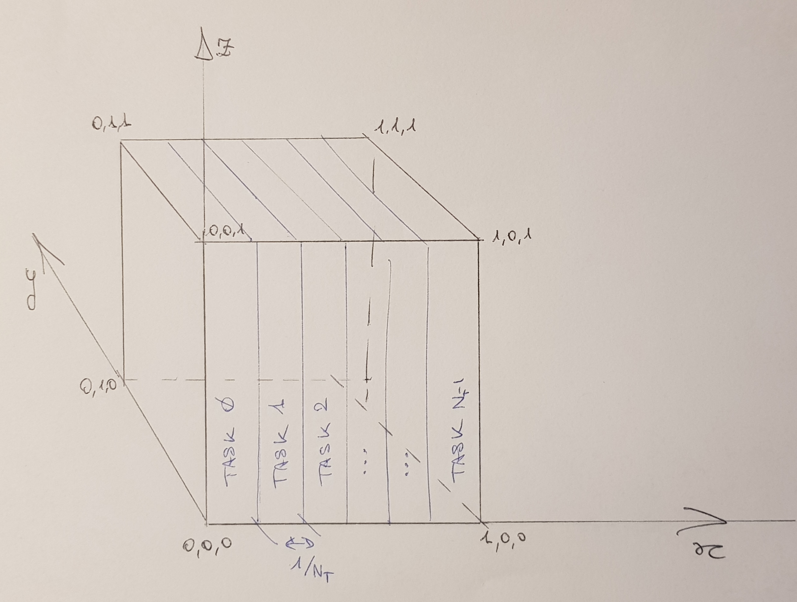

Foundations of HPC 

# @ Data Science and Scientific Computing 2019-2020

### <font color='red'>ASSIGNMENT III, Dec 18</font>

#### <font color='red'>Due date: Jan, 17th, 2020 h00:00</font>

**In this assignment you are requested to choose 1 among the proposed exercises, and to implement either an MPI or an OpenMP code.**

**The mark corresponding to each code is stated in the exercises description.**

**We remind you that this assignment counts for the 30% of the final mark.**

Taking into account the fact that we have not yet covered the topic of hybrid MPI + OpenMP codes, but also that it is almost straightforward if no MPI call is made from within a multi-thread region, we encourage you to try that on the code you choose *once you have completed the assignment*.

This optional part will be rewarded, if correctly - or in any case somehow brilliantly - accomplished, by additional points (at most 10).


------

------

### EXERCISE 1

#### The Mandelbrot set

**In this exercise, you are required to implement a parallel code that iteratively calculates  Eq. $\eqref{eq:mandelbrot}$ for a given section of the complex plane (or, in other words, that computes the Mandelbrot set).**


The Mandelbrot set is generated on the complex plane $\mathbb{C}$  by iterating the complex function $f_c(z)$ whose form is
$$
f_c(z) = z^2 + c \label{eq:mandelbrot}
$$
for a complex point $c=x+iy$ and starting from the complex value $z=0$ so to obtain the series
$$
z_0 = 0,\, z_1 = f_c(0),\, z_2 = f_c(z_1),\, \dots,\, f_c^n(z_{n-1})
$$

The $Mandelbrot\, Set\, \mathcal{M}$ is defined as the set of complex points $c$ for which the above sequence is bounded. It may be proved that once an element $i$ of the series  is more distant than 2 from the origin, the series is then unbounded.
Hence, the simple condition to determine whether a point $c$ is in the set $\mathcal{M}$ is the following
$$
\left| z_n = f_c^n(0)\right| < 2\;\; \text{or}\;\; n > I_{max}
\label{eq:condition}
$$
where $I_{max}$ is a parameter that sets the maximum number of iteration after which you consider the point $c$ to belong to $\mathcal{M}$ (the accuracy of your calculations increases with $I_{max}$, and so does the computational cost).

Given a portion of the complex plane, included from the bottom left corner $c_L = x_L + iy_L$ and the top right one $c_R = x_R + iy_R$, an image of $\mathcal{M}$, made of $n_x \times n_y$ "pixels" can be obtained deriving, for each point $c_i$ in the plane, the sequence $z_n(c_i)$ to which apply the condition $\eqref{eq:condition}$, where
$$
\begin{aligned}
c_i &= (x_L + \Delta x) + i(y_L + \Delta y) \\
 \Delta x &= (x_R - x_L) / n_x \\
 \Delta y &= (y_R - y_L) / n_y\,.
\end{aligned}
$$
In practice, you define a 2D matrix `M` of integers, whose entries `[j][i]` correspond to the image's pixels. What pixel of the complex plane $\mathbb{C}$ corresponds to each element of the matrix depends obviously on the parameters $(x_L, y_L), (x_R, y_R), n_x, \text{ and } n_y$.

Then you give to a pixel `[j][i]` either the value of 0, if the corresponding $c$ point belongs to $\mathcal{M}$, or the value $n$ of the iteration for which
$$
\left| z_n\left(c\right) \right| > 2
$$
($n$ will saturate to $I_{max}$).

This problem is obviously embarrassingly parallel, for each point can be computed independently of each other and the most straightforward implementation would amount to evenly subdivide the plane among concurrent processes (or threads). However, in this way you will possibly find severe imbalance problems because the $\mathcal{M}$'s inner points are computationally more demanding than the outer points, the frontier being the most complex region to be resolved.

**A correct version, either in MPI or in OpenMP, of the straightforward implementation will still be considered a valid solution of this exercise, but worth a maximum of most 24 points. Taking into account its simplicity, no additional points will be accounted for implementing more than one version. 3 points will be added for an hybrid version.**
**More sophisticated implementation, with a balanced work distribution, that you have to conceive and implement, will be worth the full mark of at most 30 points. At most 10 additional points will be recognised for implementing *both* MPI *and* OpenMP versions. At most 10 additional points will be recognized for implementing an hybrid MPI+OpenMP version**.


#### Requirements:

1. your code have to accept $I_{max}, c_L, c_R, n_x \text{ and } n_y$ as arguments. Specifically, the compilation must produce an executable whose execution has a proper default behaviour and accept argument as follows:
   `./executable n_x  n_y  x_L  y_L  x_R  y_R  I_max`

2. the size of integers of your matrix `M` shall be either `char` (1 byte; $I_{max} = 255$) or `short int` (2 bytes; $I_{max}=65535$).
   
3. your code must produce a unique output file, using MPI I/O if you choose to implement the MPI version. The output must be in one of the 2 following format:

   - simple binary format, as follows:
     4 double: $x_L, y_L, x_r, y_R$
     3 integers (4 bytes long): $n_x, n_y$ and $I_{max}$
     The exact dump in row-major order of the 2D matrix `M` that you have calculated.
   - you may **directly produce an image file** using the very simple format `.pgm` that contains a grey-scale image. You find a function to do that, and the relative simple usage instructions, in Appendix I at the end of this page.
     In this way you may check in real time and by eye whether the output of your code is meaningful.

4. you have to determine the strong and weak scaling of your code, accordingly to the choice of developing an MPI or OpenMP (or hybrid) version. The corresponding plots will be part of your report.

   

> **Note 1:** Mandelbrot set lives roughly in the circular region centered on $(-0.75, 0)$ with a radius of $\sim 2$.

> **Note 2:** the multiplication of 2 complex numbers is defined as $(x_1 + iy_1)\,\times\,(x_2+iy_2) = (x_1x_2 - y_1y_2) + i(x_1y_2+x_2y_1) $


------

------

### Exercise 2

#### N-Body code

The N-Body problem is representative of a large class of problems in scientific computing. It amounts to solve the evolution of a system of $N$ interacting particles (we consider here a closed system, i.e. the only forces acting to the particles are due to the mutual interaction within the system itself).

Specifically, here you are required to solve the problem of an interaction that has a Coulomb potential
$$
V(r) \propto \frac{e_1\cdot e_2}{\left\| \pmb{r_1} - \pmb{r_2} \right\|}
$$
where $\pmb{r_1}$ and $\pmb{r_2}$ are the vector positions of 2 interacting particles whose charges are $e_1$ and $e_2$ respectively. In this exercise actually we do consider the gravitational problem, where only 1 charge type exists (the mass of the particle).

Hence, the mutual force between 2 particles is:
$$
\pmb{F_{1,2}} = G\frac{m_1 \cdot m_2}{\left\| \pmb{r_1} - \pmb{r_2} \right\|^3}\cdot \left( \pmb{r_1} - \pmb{r_2}\right)
$$
from which you derive their mutual acceleration
$$
\pmb{a_{1,2}} = \pmb{F_{1,2}} / m_{1,2}.
$$
We are proposing you the *collisional*  [^1] problem, i.e. to solve the interaction among true material bodies.

[^1]: as opposed to the *collisionless* problem, where the "particles" are actually a sample of the matter distribution in space and not real bodies

As such, the resultant force on a particle $q$ is the summation of all the direct interactions with all the other particles:
$$
\pmb{F}_q = Gm_q\sum_{i=0, i\ne q}^N m_i\frac{\left(\pmb{r_1} - \pmb{r_2}\right)}{\left\| \pmb{r_1} - \pmb{r_2} \right\|^3}
$$


Hence, the variation on velocity and positions in a given time step $\Delta t$ are:
$$
\begin{equation}
\begin{aligned}
\Delta\pmb{v}_q(t) &= \pmb{v}_q(t) + \pmb{a}_q(t)\cdot\Delta t \\
\Delta\pmb{r}_q(t) &= \pmb{r}_q(t) + \left(\pmb{v}_q(t) + \Delta\pmb{v}_q(t)\right)\cdot\Delta t
\end{aligned}
\end{equation}
$$
Of course, *that is **not** a correct integration scheme* and if applied it would lead to a broadly wrong evolution. However, the focus here is not about the physically correct evolution of an N-body system, so we will stick to this integration scheme because of its simplicity.

Still for the sake of simplicity, you may consider to forget about real physical quantities. Use $G=10^{-6}$ (to avoid too large accelerations) and *natural units*: in practice, do not worry about the fact that positions, velocities and accelerations are expressed in physical units, just consider them as pure numbers.

**This exercise is worth at most 40 points. At most 10 additional points will be given for the implementation of *both* MPI *and* OpenMP versions. At most additional 10 points will be given for the implementation of an hybrid MPI+OpenMP version.**

#### Requirements:

1. You shall generate the *initial conditions* (i.c. since now on) , i.e. the initial distribution of the particles in your computational domain: let's consider it is a cubic box of side 1.
   Then, your particles will be confined initially in the volume $[0:1]\times[0:1]\times[0:1]\in\mathbb{R}^3$ and they will be uniformly distributed in that volume. The main parameter for that is $N_p$, which is the total number of particle in your system.
The total mass in your system is, instead, fixed to the value $M_{tot} = 100$ ( then, your particle mass $m$ varies with the particles number $N_p$ ).

The particles must have (at least) the following properties: a 3D position, a 3D velocity and an Energy.

   The particle positions can be randomly distributed in the volume in a uniform way and will have the same mass $m=1$ (so you can practically ignore the particles' mass).
   The single components of the 3D velocities (i.e. the values $\pmb{v}_i = [\, v_{x}, v_{y}, v_{z} \,]_{i=1,\dots,N_p}$ ) must be randomly distributed with a Gaussian pdf centered on $0$, having $\sigma = 0.01$.
At this moment, particles' energy is set to the pure kinetic energy of the particle, $E_{i,kin} = 1/2 * m_i\cdot \|\pmb{v}_i\|^2$.

We require that your code must be able to perform a **domain decomposition among MPI tasks**, even if your N-body code is implemented in OpenMP. Then there are two cases:

   - you implement the N-Body code in OpenMP
     In this case, we require a separate MPI code that generates the initial conditions. In that code, all the $N_T$ MPI tasks will generate a fraction $N_p/N_T$ (note: you have to handle the remainder $N_p \bmod N_T$) of the particles and then all the tasks will cooperate to distribute them .
     In fact, for this task you will consider your computational domain as subdivided in $N_T$ slices along one of the axis, so that the task $T_i$ is responsible for the particles that live in the $i-th$ slice (see Fig. 1 here below) and must receive all of them and only them.
     
     
     
     
     
     <p align="center">Fig. 1</p>
     After the i.c. generation, your code will write a file that contains the i.c. (see Note 2 about the format). Your OpenMP code will start reading the i.c. from a generic file (given as input argument) that has that same format.
     To write this file, either you use the MPI I/O, so that all the MPI tasks write on the same files, or a different approach (for instance, each MPI task writes its own file or every evenly numbered MPI task $T_i$ writes a file with its data and the data of its neighbour task $T_{i+1}$). Whichever approach you choose, however, the reading of the file must be independent of the number of files in which the i.c. are splitted. In other words: if you choose to write a separate file for every MPI task, and you generate them with $N_{T_1}$ tasks, then you must be able to read and distribute the i.c. when running with a different number of tasks $N_{T_2}$.
     
   - you implement an MPI code

    In this case, the previously described code can be simply part of your code, and the i.c. generation and the domain decomposition can be the first phase of your run.


2. Once the i.c. have been generated (or read in), your code must enter in a loop in which the resultant force for each of the particles is determined, their new positions are calculated, and the new time-step is obtained with the constraint $\Delta t \le \Delta t_{max}$  such that
   $$
   \left|\frac{\Delta\pmb{v}}{\pmb{v}}\right|_{max}\lt \epsilon .
   $$

   where $\epsilon$ is a parameter of your code (let's say of the order of $\sim 0.05$).
   Such a loop may have a form similar to

   ```C
   time    = 0;
   delta_t = delta_t_max;
   for ( int iter = 0; iter < iter_max && time < time_max; iter++ )
   {
       estimate_forces(delta_t);
       calculate_new_positions_and_energies(delta_t);
       
       update_total_system_energy()
           
       time   += delta_t;
       delta_t = obtain_new_delta_t();
       
       if( iter % time_to_write_a_checkpoint )
        write_a_checkpoint_file()
   }
   ```

Let us comment on few points, to further simplify the problem:

- As for the design of the force estimation, you are allowed to assume that the total number of particle $N_p$ will always be small enough that the whole system can reside in each of the MPI process [^2] (or, obviously, on a single node as for what concerns the OpenMP implementation). In fact, by reason of the collisional scaling $\sim O(N_p^2)$, $N_p$ is typically at the scale of $N_p \lesssim 10^7$.
  
- The time-step $\Delta t$ is the same for all the particles, i.e. it is a global time-step.
  
- For the purpose of this assignment, `iter_max` can be as small as 2, since the focus is not on the correct evolution of the gravitational system.
  
- As a consequence of the previous point. you can ignore the fact that while the system is evolving and the particles are moving, the domain decomposition should, in principle, be updated. Each MPI task, or OpenMP thread, will continue to update the particles it has been given after reading the i.c.
  
- The loop example shown above is indeed only an example. For instance, in your design, you may choose to merge the estimate of forces and the update of the positions and the energy.

- The energy of a particle $i$ is the sum of its kinetic energy and its potential energy:
   $$
   E_i = \frac{1}{2}m_i\|\pmb{v}_i\|^2 + G\sum_{j=0, j\ne i}^{N_p }\frac{m_j}{\|\pmb{r_i} -\pmb{r_j} \|}\,.
   $$
     

[^2]:That would be dreadfully wrong for a collisionless simulation, since the complexity of those problem scales as $\sim O(N_p log(N_p))$ and a considerable number of particles is routinely used for those simulations (as large as $\sim 10^{10}$)


> **Note 1:** **data structure**
> a suitable C data structure could be the following:
>
> ```C
> typedef struct { double a[3]; } vect;
> typedef struct { vect pos; vect vel; double E;} particle;
> 
> // pos is the 3D particle's position
> // vel is the 3D particle's velocity
> // E is the particle's energy
> // mass is not needed, since all the particles are created equal
> 
> ```
>

> **Note 2:** **format of the i.c. file**
>
> The i.c. file must be a binary file formatted as follows:
>
> - 1 integer (4 bytes): the floating-point precision of the data in the file, expressed in bytes (i.e. either 4 or 8)
> - 1 integer (4 bytes): the number of particles in the file
> - 1 integer (4 bytes): the number of files in which the file is splitted (if you write the file using separate files for each MPI task, that may help the reconstruction). 
> - 1 double: the time of the file (0 for the i.c., the evolution time for the chekpoint files)
> - all the particles in sequence: 7 floating points for each of them (3 for the position, 3 for the velocity and 1 for the energy). No particular order among the particles is required.


### Summary of the points

|                                             | MPI or OpenMP | *both* MPI *and* OpenMP | hybrid MPI+OpenMP |
| ------------------------------------------- | ------------- | ----------------------- | ----------------- |
| **Exercise 1**<br />straightforward version | 24            | -                       | +3                |
| **Exercise 1**<br />work-balance version    | 30            | +10                     | +10               |
| **Exercise 2**                              | 40            | +10                     | +10               |

Examples:

- you choose Ex.1, the simple version. If everything is correct, you get up to 24 points (i.e. up to 8 points of your final mark)
- you choose Ex.1, the w-balance version, and you implement both an MPI and an OpenMP versions: you get at most 40 points (i.e. 12 points of your final mark). If you also add the hybrid version, you get at most 50 points (i.e. 15 points of your final mark)
- you choose Ex. 2 and you develop 3 versions: MPI, OpenMP and hybrid. You get at most 60 points (i.e. 20 points of your final mark)
- you choose both Ex.1, the w-balance flavour, and Ex. 2, and you develop 6 codes: 2 MPI, 2 OpenMP and 2 hybrid. You get at most 110 points (and you get your final degree.. ops not, you get 33 points of your final mark).

Your final mark will still be expressed in units of 30 points, as you know, plus a possible laude. The rationale of accumulating more points is to secure a very high mark and the laude.


------

------

### Appendix I

#### Writing a `PGM` image

The `PGM` image format, companion of the `PBM` and `PPM` formats, is a quite simple and portable one.
It consists in a small header, written in ASCII, and in the pixels that compose the image written all one after the others as integer values. A pixel's value in `PGM` corresponds to the grey level of the pixel.
Even if also the pixels can be written in ASCII format, we encourage the usage of a binary format.

The header is a string that can be formatted like the following:

`printf( "P5\n%d %d\n%d\n", width, height, maximum_value );`

where "`P5`" is a magic number, `width` and `heigth` are the dimensions of the image in pixels, and `maximum_value` is a value smaller than `65536`.
If `maximum_value < 256`, then 1 byte is sufficient to represent all the possible values and each pixel will be stored as 1 byte. Instead, if `256 <= maximum_value < 65536`, 2 bytes are needed to represent each pixel (that is why in the description of Exercise 1 we asked you that the matrix `M` entries should be either of type `char` or of type `short int`).

In the sample file `write_pgm_image.c` that you find the `Assignment03` folder, there is the function `write_pgm_image()` that you can use to write such a file once you have the matrix `M`.

In the same file, there is a sample code that generate a square image and write it using the `write_pgm_image()` function.
It generates a vertical gradient of N~x~ x N~y~ pixels, where N~x~ and N~y~ are parameters. Whether the image is made by single-byte or 2-bytes pixels is decided by the maximum colour, which is also a parameter.
The usage of the code is as follows

```bash
cc -o write_pgm_image write_pgm_image.c
./write_pgm_image [ max_val] [ width height]
```

as output you will find the image `image.pgm` which should be easily rendered by any decent visualizer .

Once you have calculated the matrix `M`, to give it as an input to the function `write_pgm_image()` should definitely be straightforward.


### Appendix II

#### A note about hybrid MPI+OpenMP

Although we did not yet discuss this topic in the class, at the level you may use it here that is quite straightforward. As you have seen, it is obviously not a requirement but just an opportunity for those among you that like to be challenged.

As long as you use OpenMP regions in a MPI process for computation *only* and *not* to execute MPI calls, everything is basically safe and you can proceed as usual with both MPI and OpenMP calls and constructs.

It may be safer, however, to initialize the MPI library with a call slightly different than `MPI_Init()`:

```C

int mpi_provided_threaD_level;
MPI_Init_threads( &argc, &argv, MPI_THREAD_FUNNELED, &mpi_provided_thread_level);
if ( mpi_provided_thread_level < MPI_THREAD_FUNNELED ) {
 	printf("a problem arise when asking for MPI_THREAD_FUNNELED level\n");
    MPI_Finalize();
    exit( 1 );
}

...;   // here you go on with BaU

MPI_Finalize();
return 0;
```

