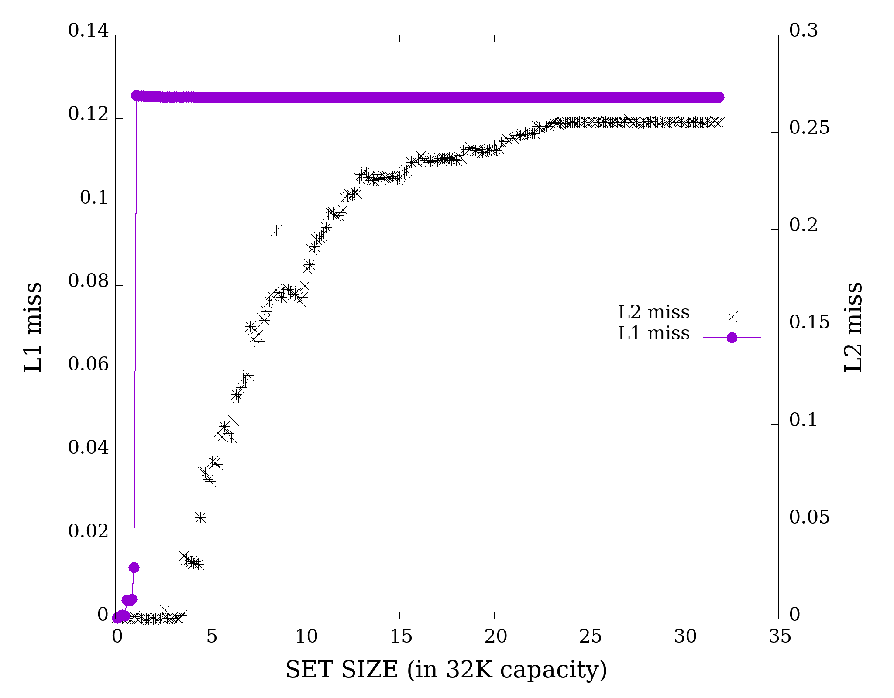

# Exercise on memory aliasing and some basic cache elements


## - 1 - Playing with caches
#### 1.1 the Memory Mountain

#### 1.2 get your L1 cache size

This example is about inspecting the effect of cache size on the execution time of simple tasks.
The code `cache_size.c` traverses an array just performing the simple operation

```c
array[i] = b*array[i]+c
```

As long as the whole array can fit in the L1 cache, the number of L1 cache misses is virtually zero (if the cache has been warmed-up so to avoid the compulsory misses). 
When the array size grows, it can not resides entirely in the cache and so compulsory cache misses are unavoidable and you can count them by accessing the performance counters.
Since the access to the array is sequential, i.e. without strides like `array[i+stride]=b*array[i+stride]*c`, there are only the compulsory misses.

The same happens in the L2, with different thresholds due to its larger size.
The code prints out a line for each array size, where the size is expressed in terms of the number of `double` elements it contains:


(the other columns in the output should be clear by their names).
You should try to compile the code with and without optimization and, possibly, using compiler's vectorization:

```bash
gcc -o cache_size.x cache_size.c -lpapi
gcc -O3 -o cache_size.O3.x cache_size.c -lpapi
gcc -O3 -march=native -o cache_size.O3.x cache_size.c -lpapi
```


Then, execute it saving its output in a file:

```bash
/cache_size.x > cache_size.out
/cache_size.O3.x > cache_size.O3.out
/cache_size.O3n.x > cache_size.O3n.out
```

and visualize the output by invoking the small `gnuplot` script that you find in the same dir:

```bash
gnuplot -e `infile="cache_size.out"` plot_cache_size.gp
```

(the script wants an argument, named "infile", which obviously is the name of the file to be plotted).

It produces two files:

- `misses.png` that plots the L1 and L2 cache misses as functions of the array sizes (expressed on the $x$ axis in units of $32$K); the $y$ right axis report the scale for the L2 misses, the left axis that for L1 misses.
-  and `cpe.png` that shows the L2 misses and the cycles spent for each element (left $y$ axis)

The results on my laptop look like:

*Fig 1: L1 and L2 misses with no optmization*

*Fig. 2: CPE and L2 misses with no optimization*

*Fig 3: L1 and L2 misses with -O3 -march=native*


*Fig 4: CPE and L2 misses with -O3 -march=native*

#### 1.3 hot and cold fields in data structures

This example is about the difference in performances that you can get just by modifying the data layout.
In this case, the focus is on splitting _hot_ and _cold_ data fields in structure.

## - 2 - memory aliasing

#### first example, `memory_alising_1/`

###### **_Compilation_**

Compilation should be straight forward:

```bash
cc -std=c11 -o pointers_aliasing_<a|b|c> pointers_aliasing_<a|b|c>.c
```

where `<a|b|c>` stands for "a choice among a, b, c".
Compile with and without simple optimisation (i.e. just using -On argument without other special option):

```bash
cc -std=c11 -On -o pointers_aliasing_<a|b|c> pointers_aliasing_<a|b|c>.c
```

where the maximum `n`  level of `-O` option is 3 for `gcc` and `icc`, 4 for `pgcc`.

Try with different compilers (Intel's and PGI's compilers are free to download).

TIPS for compilation:

-  `gcc`
  - you may want to add `-march=native`
-  `icc`, `pgcc`
  - you can add `-fast`
-  `pgcc`
  - standard `c11` is specified as `-c11` instead of `-std=c11`


You find 2 simple bash scripts: `compile_all` and `run`. The former allows you to compile the 

###### results with different compilers
|  | gcc |  | pgi |  | icc |  |
| :- | :-----: | :------: | :------: | -------- | -------- | -------- |
| **case** | ***no-opt*** | ***opt*** | ***no-opt*** | ***opt*** | ***no-opt*** | ***opt*** |
| a    | 0.028 | 0.0051 | 0.024 | 0.0071 | 0.004 | 0.0078 |
| b    | 0.028 | 0.0051 | 0.024 | 0.0032 | 0.004 | 0.0031 |
| c    | 0.030 | 0.0029 | 0.025 | 0.0029 | 0.0029 | 0.0017 |


#### second example, `memory_aliasing_2`
###### **_Compilation_**

As in previous case, the compilation should be straight forward:

```bash
cc -std=c11 -o aliasing driver.c loop.c
```

Compile with and without optimization (see tips for the precious examples).

Try with different compilers.

|  | gcc |  | pgi |  | icc |  |
| :- | :-----: | :------: | :------: | :------: | :------: | :------: |
| **case** | ***no-opt*** | ***opt*** | ***no-opt*** | ***opt*** | ***no-opt*** | ***opt*** |
| aliasing | 0.032 | 0.009 | 0.027 | 0.0093 | 0.01 | 0.0095 |
| no alias | 0.032 | 0.0075 | 0.027 | 0.0093 | 0.01 | 0.0093 |